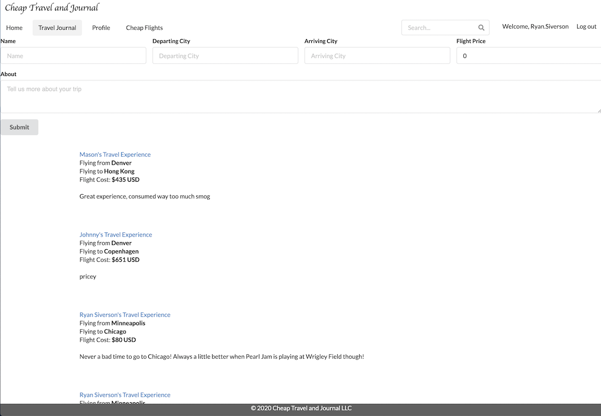

## Table of Contents
##### 1. [Project Description](#Project-Description)
##### 2. [GitHub Address](#GitHub-Address)
##### 3. [License Type](#License-Type)
##### 4. [Dependencies](#Dependencies)
##### 5. [Test Run Commands](#Test-Run-Commands)
##### 6. [Author Contact Information](#Author-Contact-Information)
---
# **Cheap Travel**

### **Project Description:**
##### A React built site that allows you to log in using Auto0 and leave reviews of inexpensive trips you have taken to inspire others. A travel API has been implemented to search for cheap travel as well.
---
### **GitHub Address:**
[Cheap Travel](https://github.com/rysiphoto/cheap-travel)
---
### **License Type:**
##### MIT

---
### **Dependencies**
##### npm i
---
### **Test Run Commands**
##### npm start
---
### **Image**

##### 
---
### **Author Contact Information:**
{ width=50% }
* Ryan Siverson
* rcsskier@mac.com
* [GitHub](https://github.com/rysiphoto)
* [LinkedIn](https://www.linkedin.com/in/ryan-siverson-695b5a32/)

---
---
###### © Ryan Siverson 2020
